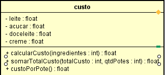
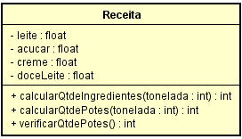
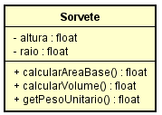
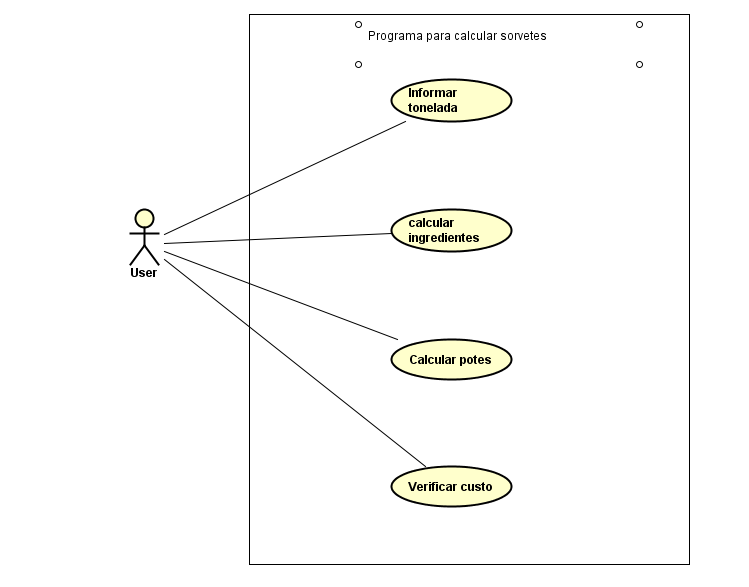
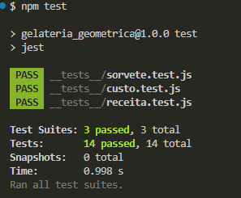

# 🍦 Gelateria Geométrica - Fábrica 4.0

## 1. Identificação do Projeto
* **Título do Projeto:** Gelateria Geométrica - Fábrica 4.0
* **Equipe de Desenvolvimento:** * Carlos Roberto da Silva Filho
  * João Pedro Keidann
  * Pedro Henrique Caldart Warmling
  * Abel Silva Neto
  * Davi Pereira Fagundes

---


## 2. Visão Geral do Sistema e História do Usuário

**O Contexto:** Uma rede de sorveterias artesanais está expandindo suas operações para o modelo de **Indústria 4.0**. O modelo de negócios mudou: em vez de vender apenas no balcão, a empresa agora produz sorvete em **toneladas** para distribuição em supermercados. 

**O que o Sistema Faz (A Solução):**
Para resolver esse problema, criamos a **"Gelateria Geométrica"**, um aplicativo web/mobile projetado para o Gerente de Produção. O sistema automatiza toda a matemática industrial da sorveteria da seguinte forma:

1. **Escalonamento de Receita:** O usuário define uma meta de produção industrial (1, 5 ou 12 toneladas). O sistema pega a receita base artesanal e multiplica as proporções exatas de cada ingrediente para a escala em toneladas, gerando uma lista de compras precisa.
2. **Cálculo de Volume e Densidade:** O usuário seleciona o tipo de pote (400g, 900g, 1700g) ou informa as medidas de um pote personalizado (raio e altura). O sistema usa a densidade fixa do sorvete (**0.6 g/cm³**) para converter o volume geométrico do pote em peso real.
3. **Relatório Financeiro:** Por fim, o aplicativo gera um relatório com a precisão de duas casas decimais informando o **Custo Total de Produção**, o **Custo Unitário por Pote** e o **Custo De cada ingrediente**, permitindo que a diretoria defina o preço final de venda para os supermercados.

---

## 3. Especificações Técnicas (Baseadas na ISO 25010)

Os Requisitos Não Funcionais (RNF) do sistema foram rigorosamente guiados pela norma ISO 25010:

* **RNF01 (Portabilidade / Adaptabilidade):** Sistema desenvolvido em JavaScript ES Modules (import/export), garantindo código modular e compatibilidade com navegadores modernos sem transpilação complexa. Tecnologias base: Node.js, HTML5 e CSS3.
* **RNF02 (Usabilidade / Estética):** Interface de usuário projetada de forma responsiva com foco exclusivo no **iPhone 14 (resolução alvo de 390px x 844px)**.
* **RNF03 (Eficiência de Desempenho / Comportamento Temporal):** Processamento rápido de cálculos industriais complexos (conversões de toneladas e potes), com tempo de resposta estipulado em menos de 2 segundos.
* **RNF04 (Capacidade de Manutenção / Testabilidade):** Lógica matemática e regras de negócio testadas via **Jest**, buscando ampla cobertura nas classes `Sorvete`, `Receita` e `Custo`.
* **RNF05 (Usabilidade / Proteção contra Erro do Usuário):** Prevenção de quebras no sistema através do bloqueio de processamento de dados nulos ou caracteres inválidos (o sistema lida nativamente com tipagens e retornos controlados na interface).

---

## 4. Requisitos Funcionais e Regras de Negócio

### Requisitos Funcionais (RF)
* **RF01:** Permitir a escolha entre tamanhos pré-definidos de recipientes cilíndricos: pequenos (400g), médios (900g) ou grandes (1700g), além da possibilidade de personalização.
* **RF02:** Calcular o volume de potes customizados com base no raio e altura informados via input.
* **RF03:** Calcular a lista de compras/quantidade de ingredientes estritamente proporcional à tonelagem escolhida (1T, 5T ou 12T).
* **RF04:** Exibir o Custo Total de produção e o Custo por Pote a partir dos valores de referência padrão da fábrica.

### Regras de Negócio (RN)
* **RN01 (Densidade):** O cálculo de conversão entre peso e volume usa a constante industrial de **0.6 g/cm³** (Peso = Volume x 0.6).
* **RN02 (Arredondamento de Potes):** É proibida a contabilização de potes incompletos. Utiliza-se `Math.floor` para arredondar sempre para o número inteiro inferior.
* **RN03 (Escalabilidade):** As proporções da receita base (calculada em 900g) são dinamicamente escaladas para a meta selecionada (1.000 kg, 5.000 kg ou 12.000 kg).
* **RN04 e RN05 (Precisão Financeira):** Todos os resultados de custo e relatórios financeiros são obrigatoriamente formatados com **duas casas decimais** (`.toFixed(2)`).

---

## 5. Modelagem e Design

* **Diagrama de Classes (UML):**
  *
  *
  *

* **Diagrama de Casos de Uso:**
  

* **Link Protótipo Wireframe (Figma):**
  https://www.figma.com/design/p98XfUWElObBq86FaFByLe/Untitled?node-id=0-1&p=f

* **Link do projeto no vercel:**
  https://gelateria-geometrica.vercel.app/

* **Link github do projeto:**
  https://github.com/jpkeidann/Gelateria_Geometrica

---

## 6. Cobertura de Testes

Os testes unitários foram estruturados para atender ao **RNF04**, validando integralmente a lógica central das classes:

* **Teste de Arredondamento (RN02):** Garantimos que em `receita.test.js` a divisão do peso total pelo peso do pote nunca retorne um valor fracionado. Exemplo: *Testamos a regra de arredondamento na classe Receita para garantir que nunca seja produzido um pote incompleto.*
* **Teste de Precisão Financeira (RN04):** Garantimos que `custo.test.js` trate os cálculos de variáveis flutuantes evitando dízimas infinitas.
* **Teste de Geometria (RN01):** Garantimos que `sorvete.test.js` valide o cálculo matemático da área do cilindro (π * r²) e a multiplicação pela constante `0.6`.

**Status dos Testes:**


---

## 7. Instruções de Instalação e Execução

Para rodar o projeto localmente para validação:

1. **Clonagem do repositório:**
   ```bash
   git clone [https://github.com/seu-usuario/gelateria_geometrica.git](https://github.com/seu-usuario/gelateria_geometrica.git)
   cd gelateria_geometrica

### Instalação de Dependências

Para que o ambiente de testes e execução funcione corretamente, é necessário instalar as dependências mapeadas no arquivo `package.json` (que incluem o Jest para os testes unitários e o Babel para a compatibilidade dos módulos).

No seu terminal, certifique-se de estar na pasta raiz do projeto (`gelateria_geometrica`) e execute o seguinte comando:

```bash
npm install